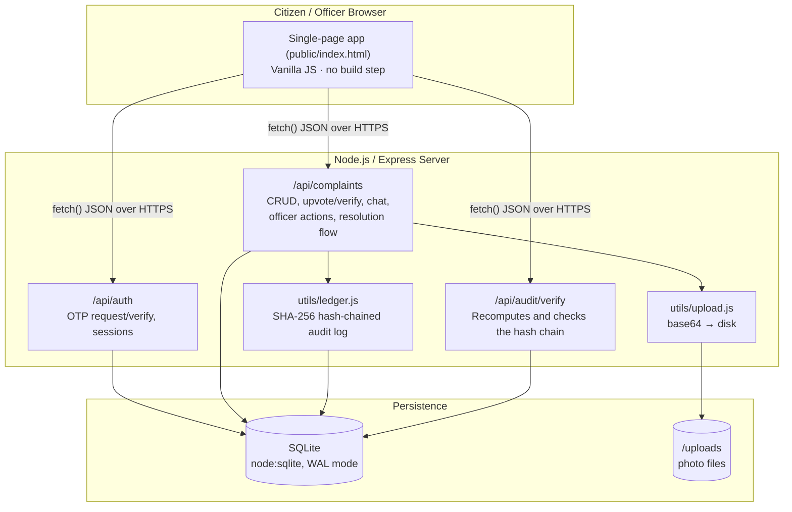

# NagarSetu (Civic Tracker) — Technical Architecture

> Citizen civic-issue reporting and tracking platform with a public officer
> dashboard and a cryptographically tamper-evident audit trail.

---

## 1. Tech Stack

| Layer | Choice | Why |
|---|---|---|
| **Runtime** | Node.js 22+ | Single language across the stack; native `fetch`, native `node:sqlite`. |
| **Backend framework** | Express.js | Minimal, well-understood, fast to build REST APIs with. |
| **Database** | SQLite via Node's built-in `node:sqlite` module | **Zero native dependencies** — no `better-sqlite3`/`sqlite3` compiled binary to break across hosts. Ships inside Node itself. Perfectly suited to a civic-pilot's read-heavy, moderate-write workload; swappable for Postgres later without touching route logic (queries are plain SQL behind a thin `db.js`). |
| **Auth** | Phone number + OTP → signed session token | Matches how most citizens already verify identity on Indian government/utility apps; no password to manage or leak. |
| **File/photo storage** | Base64 payloads over JSON, decoded server-side to disk | Avoids a multipart-parsing dependency (`multer`); keeps the client → server contract to one content type (`application/json`) end-to-end. |
| **Frontend** | Vanilla JS, single-file SPA (no build step) | Zero build tooling, zero framework version drift, deploys as a single static HTML file served by Express — one process, one artifact. |
| **Audit / integrity layer** | Custom SHA-256 hash chain (`utils/ledger.js`) | See §3 — a genuinely tamper-evident ledger without the operational overhead of running a real blockchain node for a civic pilot. |
| **Hosting model** | Single persistent Node process + attached disk (Render / Railway / Fly.io) | The app is stateful (SQLite file + uploaded photos), so it needs a real server, not a serverless/static host. |

**Why not a heavier stack (React/Next.js, Postgres+ORM, Docker Compose, etc.)?**
For a hackathon-to-pilot civic tool, every extra layer is an extra thing that
can break in a live demo or a low-resource government deployment. This stack
optimizes for **auditability and deployability**: one process, one database
file, one HTML file, no build pipeline — while still being a real,
production-shaped Express + SQL app rather than a mock.

---

## 2. Technical Architecture



**Request flow, end to end:**

1. **Citizen reports an issue** → `POST /api/complaints` → validated, written
   to SQLite, a `"Complaint first opened"` entry is appended to the hash
   chain, response includes the full serialized complaint.
2. **Officer acts on it** (status/priority change, resolution proof, chat)
   → gated by an officer-key header → every action appends another
   chained ledger entry, so there's a permanent, ordered, verifiable record
   of who did what and when.
3. **Citizen confirms or reopens** → same pattern: the action *is* the
   ledger entry, not a side effect of one.
4. **Auto-resolve safety net**: a background sweep (and an on-demand
   `/simulate-timeout` endpoint for demos) auto-closes resolutions the
   citizen never confirmed within N days, marking them explicitly
   **unverified** rather than silently "resolved" — and logging that as a
   ledger entry too.
5. **Anyone can verify the whole system's integrity** at any time via
   `GET /api/audit/verify`, without needing to trust the server's word for
   it — the hash chain is recomputed from raw data on every call.

**Why this shape:** the complaint lifecycle (open → assigned → in progress →
resolution submitted → citizen-confirmed / auto-resolved → optionally
reopened/escalated) is the actual product; the architecture just makes every
transition in that lifecycle an auditable, timestamped, chained fact instead
of a mutable database row that anyone with DB access could quietly edit.

---

## 3. "Blockchain" component — a real hash-chained audit ledger

We deliberately did **not** bolt on a distributed blockchain (Ethereum/Polygon
smart contracts, a consensus network, gas fees) for a civic MVP — that adds
infrastructure complexity and cost without adding trust for a
single-authority system like a municipal complaints register. Instead we
implemented the actual cryptographic primitive blockchains are built on —
a **hash chain** — and applied it directly to the thing that matters here:
the complaint history log.

### How it works

Every event in a complaint's lifecycle — opened, assigned, priority
reviewed, resolution submitted, citizen confirmed, reopened, escalated,
officer note — is appended as one record to a single, system-wide,
append-only chain:

```
hash_n = SHA256( hash_(n-1)  ‖  complaint_id  ‖  label  ‖  who  ‖  role
                 ‖  path  ‖  note  ‖  icon  ‖  timestamp )
```

- Each new record's hash depends on **every record before it**, all the way
  back to a genesis hash (`0x000…0`).
- Changing, deleting, or reordering *any* past entry — even one character in
  a note field — changes that entry's hash, which no longer matches what the
  next entry committed to, which breaks every hash after it. The tampering
  is not just theoretically prevented; it's **detectable**.
- `GET /api/audit/verify` walks the entire chain from genesis, **recomputes**
  every hash from the raw stored data, and reports whether it's intact —
  and if not, the exact entry where it first breaks.
- The app surfaces this directly: every history entry shows its short hash,
  and a **"Verify integrity"** button on each complaint's timeline calls
  this endpoint live, in front of the user.

### We tested this against real tampering, not just in theory

During development we directly edited a history row in the underlying SQLite
file (bypassing the app entirely, simulating a malicious admin or a
compromised database) and confirmed `verify` correctly flagged it and
pinpointed the exact row:

```json
{
  "valid": false,
  "checked": 20,
  "brokenAt": { "id": 1, "complaintId": "c1", "label": "Complaint first opened" }
}
```

### Why this is the right trade-off for this problem

| | Distributed blockchain (e.g. Polygon) | Our hash-chained ledger |
|---|---|---|
| Tamper-evidence on the audit trail | ✅ | ✅ |
| Works offline / no gas fees / no wallet UX for citizens or officers | ❌ | ✅ |
| Deployable on a single low-cost server | ❌ (needs RPC access, node ops) | ✅ |
| Appropriate trust model | Assumes no single trusted authority | Matches reality: one municipal body *is* the authority; the goal is catching internal tampering/cover-ups, not removing the authority |
| Extendable to a real chain later | — | Yes — the ledger's hashes could be periodically anchored on-chain (e.g. a Merkle root of the day's chain posted to Polygon) for even stronger public verifiability, without redesigning the core system |

**Roadmap note for judges:** the natural next step, if this needed
stronger-than-single-server guarantees (e.g. for legal/RTI evidentiary use),
is periodically publishing the chain's tip hash to a public blockchain or a
notarization service — the hash chain already gives us the one value that
would need anchoring.

---

## 4. Security & Privacy

### Authentication & session handling
- **Phone + OTP login.** No passwords stored or transmitted.
- Sessions are opaque random tokens (`crypto.randomBytes(24)`), not JWTs —
  nothing about the session is decodable client-side, and tokens are
  revocable server-side (`/api/auth/logout` deletes the session row).
- Officer-only actions (status change, priority override, resolution proof,
  officer chat) require a separate `x-officer-key` header, so a compromised
  citizen session can never perform officer actions.

### Data minimization & citizen privacy
- **Anonymous reporting mode**: no phone number is even collected server-side
  for the "report without signing in" flow beyond an optional contact number
  the citizen explicitly chooses to add.
- **Private-identity mode**: citizens can report under their verified account
  without their phone number being shown to other citizens — officers still
  see the real contact for follow-up, but the public complaint feed shows
  only a masked identity (`Citizen •••1234` / `Resident (private)`).
- Phone numbers are never rendered in full to other citizens anywhere in the
  UI — only the last 4 digits, and only for non-anonymous public complaints.

### Input handling & injection protection
- Every database query goes through **parameterized prepared statements**
  (`db.prepare(...).run(params)`) — no string-concatenated SQL anywhere in
  the codebase, so classic SQL injection is not a viable attack surface.
- Uploaded images are validated against a strict allow-list of MIME
  signatures (`data:image/jpeg|png|gif|webp;base64,...`) and size-capped
  (8MB) before being decoded to disk — arbitrary file types/payloads are
  rejected outright.

### Integrity (tying back to §3)
- The hash-chained ledger means **insider tampering with the historical
  record is detectable**, not just access-controlled. This matters
  specifically for a civic-accountability tool: the failure mode we're
  most worried about isn't an external attacker, it's a record quietly
  being altered after the fact (e.g. a resolution backdated, or an
  escalation removed). The chain makes that provable, not just policy.

### Known simplifications (honest, hackathon-appropriate scope)
These are explicitly called out rather than hidden — they're the right
scope for a hackathon MVP and the fast follow-ups for a real pilot:

| Area | Current state | Production next step |
|---|---|---|
| OTP delivery | Simulated (fixed demo code) | Real SMS provider (Twilio, MSG91) — isolated to `routes/auth.js`, one function to swap |
| Officer auth | Single shared officer key | Per-officer accounts with RBAC and individual audit attribution |
| Transport security | Depends on host | Enforce HTTPS/TLS at the hosting layer (Render/Railway/Fly all provide this by default) |
| Rate limiting | None yet | Add per-IP/per-phone rate limits on OTP request and complaint creation before public launch |
| Read access to complaints | Public by design (transparency register) | Configurable per-deployment if a jurisdiction wants it gated |

---

## 5. One-line summary for slides

> **NagarSetu is a single-server Express + SQLite civic complaint tracker
> where every officer and citizen action is written to a self-verifying,
> SHA-256 hash-chained audit ledger — so the record of what happened to your
> complaint can't be quietly rewritten, and anyone can check that live with
> one button.**
